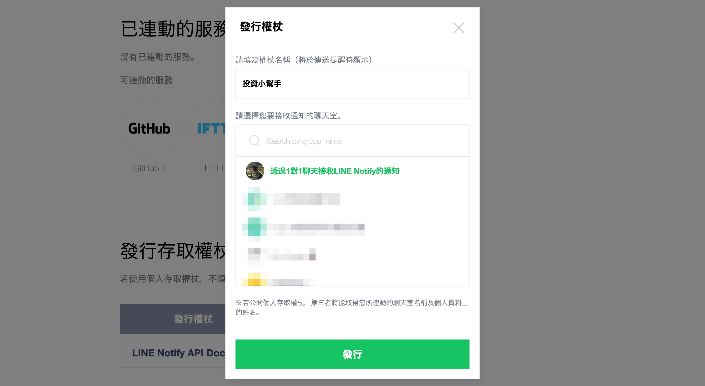

# fugle-trade-sip

> 盤中零股交易應用：打造定期定額與股息再投資的程式化交易系統

## 前言

**定期定額投資**（Systematic Investment Plan）是一種投資策略，投資人在每個特定的時間將相同數量的資金投資於特定的投資標的。因為每次投入的金額是固定的，當投資標的價格下降時，買進的數量就比較多；當投資標的價格上漲時，買進的數量就比較少。當執行定期定額一段時間後，買進的成本就會趨向平均值。因此，這種方法也被稱為 **平均成本法**（Dollar Cost Averaging）。

定期定額特別適用於「**指數化投資**」以及「**買進並持有**」的長期投資策略。伴隨經濟發展，整體股票市場市值也持續增長，如果相信人類的經濟的活動將不斷成長，並且我們想參與其中、享受人類經濟成長果實最簡單的方法，就如同指數化投資之父、先鋒集團（Vanguard）創辦人 **約翰．柏格** 所說：「**買進投資整體市場股市組合的基金，並永久持有。**」其中，**ETF**（Exchange Traded Fund）是一種常用的指數化投資工具，在台灣最知名的市值型 ETF 就是 **元大台灣50**（0050）。事實上，要長期超越市場表現並不容易，如果你還沒有找到自己信任的投資策略，那麼跟隨市場表現就是最簡單也最穩健的投資方法。

目前已有許多證券商提供定期定額投資服務，而且在一定金額以下，還有手續費折扣優惠。不過，這些服務通常有一些限制，例如扣款日期和投資標的的選擇。此外，如果有美股投資經驗並且開設海外證券帳戶，你可能會知道 **股息再投資計劃**（Dividend Reinvestment Plan）這項服務。它可以讓你將收到的股息自動再次投入同一支股票，以達到複利的效果。這種服務在國際市場已經很普遍，但在台灣證券市場仍較缺乏。因此，如果想要突破這些限制，我們可以自行開發定期定額投資系統，來執行個人化的系統性投資計劃，滿足更彈性的投資需求。

在本篇文章中，我們將學習如何運用 **Node.js**、**MongoDB** 與 **富果股市 API** 建立一個基於盤中零股交易的程式化交易系統。透過這個系統，我們將能夠實現定期定額投資與股息再投資策略的應用。此外，我們將介紹如何整合 **LINE Notify**，以便接收即時通知，讓您隨時掌握投資動態。

## 目錄

- [事前準備](#事前準備)
  - [安裝 Node.js](#安裝-nodejs)
  - [安裝 MongoDB](#安裝-mongodb)
  - [安裝 Nest CLI](#安裝-nest-cli)
  - [申請富果交易 API](#申請富果交易-api)
  - [取得富果行情 API 金鑰](#取得富果行情-api-金鑰)
  - [取得 LINE Notify 存取權杖](#取得-line-notify-存取權杖)
- [設定應用程式](#設定應用程式)
  - [建立 Nest 應用程式](#建立-nest-應用程式)
  - [安裝依賴模組](#安裝依賴模組)
  - [配置環境變數](#配置環境變數)
- [實作股票下單服務](#實作股票下單服務)
  - [整合下單與帳戶服務 ](#整合下單與帳戶服務)
  - [處理主動回報訊息](#處理主動回報訊息)
- [實作股票下單 API](#實作股票下單-api)
  - [處理股票下單 API 請求 ](#處理股票下單-api-請求)
  - [設定股票下單 API 白名單 ](#設定股票下單-api-白名單)
  - [測試股票下單 API](#測試股票下單-api)
- [實作定期定額服務](#實作定期定額服務)
  - [定義定期定額設定 ](#定義定期定額設定)
  - [存取定期定額資料](#存取定期定額資料)
  - [新增定期定額功能](#新增定期定額功能)
- [實作定期定額 API](#實作定期定額-api)
  - [管理定期定額設定 ](#管理定期定額設定)
  - [處理定期定額 API 請求](#處理定期定額-api-請求)
  - [測試定期定額 API](#測試定期定額-api)
- [Bonus：容器化應用程式部署](#bonus容器化應用程式部署)
  - [容器化技術與 Docker](#容器化技術與-docker)
  - [準備 Docker 環境](#準備-docker-環境)
  - [建構 Docker 映像檔](#建構-docker-映像檔)
  - [使用 Docker Compose 執行容器化應用程式](#使用-docker-compose-執行容器化應用程式)

## 事前準備

在開始實作前，請先準備好你的開發環境，正如俗話說：「工欲善其事，必先利其器。」

安裝開發環境時，請留意不同作業系統和版本之間的差異，為確保安裝工具能順利運作，請先確認你的本機執行環境，詳細閱讀官方文件和教學後，再進行安裝及相關設定。

### 安裝 Node.js

**Node.js** 是基於 Chrome V8 JavaScript 引擎的開放原始碼、跨平台、可用於伺服器端應用程式的執行環境，它提供事件驅動、非阻塞的 I/O 模型，讓你能有效率地建立可擴展的網路應用程式。

<figure>
  
  <figcaption><em>圖 1：Node.js</em></figcaption>
  <br><br>
</figure>

首先，你需要安裝 Node.js 環境，請前往 Node.js [官方網站](https://nodejs.org) 下載適合你作業系統的安裝檔，通常建議選擇 LTS（Long Term Support）版本，這是官方提供長期支援的穩定版本。當然，如果你想體驗 Node.js 最新功能，也可以選擇下載最新版。

<figure>
  
  <figcaption><em>圖 2：Node.js 官方網站</em></figcaption>
  <br><br>
</figure>

| TIP: |
| :--- |
| 你還可以使用 [NVM](https://github.com/nvm-sh/nvm)（Node Version Manager）這個版本管理工具來安裝 Node.js，它能讓你輕鬆切換不同版本的 Node.js。NVM 也有 [Windows](https://github.com/coreybutler/nvm-windows) 版本，你可以根據作業系統環境來進行安裝。 |

### 安裝 MongoDB

MongoDB 是一種文件導向的 NoSQL 資料庫，能靈活地儲存和處理各種非結構化或半結構化資料，同時提供強大的查詢和聚合功能。請根據你的作業系統環境，選擇適合的 MongoDB 版本。詳細的安裝步驟可以參考 MongoDB 官方網站上的 [說明](https://www.mongodb.com/docs/manual/installation)。

<figure>
  
  <figcaption><em>圖 3：MongoDB</em></figcaption>
  <br><br>
</figure>

| TIP: |
| :--- |
| 如果你熟悉 Docker，也可以透過 MongoDB 映像檔啟動容器來建立開發環境。 |

### 安裝 Nest CLI

**Nest**（NestJS）是基於 Node.js 和 TypeScript 開發的框架，能幫助你打造高效、可靠且易於擴展的應用程式，它提供了多種實用功能，支援常用的伺服端技術。透過模組化的結構，你能更方便地管理和組織程式碼。

<figure>
  
  <figcaption><em>圖 4：NestJS</em></figcaption>
  <br><br>
</figure>

Nest CLI 是由 NestJS 提供的命令列工具，能讓你輕鬆地建立、執行和管理 Nest 應用程式的各種操作。只要你已安裝好 Node.js，打開終端機並執行以下指令，即可安裝 Nest CLI：

```sh
$ npm install -g @nestjs/cli
```

安裝完成後，你可以輸入以下指令，查看 Nest CLI 提供的指令及其使用方式：

```sh
$ nest -h
```

<figure>
  
  <figcaption><em>圖 5：Nest CLI 指令列表</em></figcaption>
  <br><br>
</figure>

### 申請富果交易 API

富果交易 API 是由富果技術團隊與玉山證券合作開發的程式交易 API。你可以在 Windows、Mac 和 Linux 平台上利用富果提供的 SDK，在台灣股票市場進行程式交易。只要你完成開立玉山證券富果帳戶，並簽署「API 服務申請同意書」，就可以透過線上申請取得交易權限。富果交易 API 同時提供了 Node.js SDK 以及 NestJS 模組，你可以很輕鬆地將它整合至應用程式。

<figure>
  
  <figcaption><em>圖 6：富果交易 API</em></figcaption>
  <br><br>
</figure>

在進行正式交易前，你需要先完成富果交易 API 文件中的 [事前準備](https://developer.fugle.tw/docs/trading/prerequisites)，包含 **申請使用交易 API 服務**，並且進行 **模擬測試**，以確保程式運作正常。完成這些步驟後，即可獲得正式環境交易權限，開始體驗程式交易所帶來的便捷與效率。

### 取得富果行情 API 金鑰

在使用富果行情 API 之前，你必須註冊成為富果會員。請至富果網站完成會員註冊並且登入後 ，然後進行以下步驟。

**STEP 1**：前往富果帳戶開發者網站首頁（developer.fugle.tw），點選「文件」→「行情」。

<figure>
  
  <figcaption><em>圖 7</em></figcaption>
  <br><br>
</figure>

**STEP 2**：跳轉頁面後，在右上方點選「金鑰申請」。

<figure>
  
  <figcaption><em>圖 8</em></figcaption>
  <br><br>
</figure>

**STEP 3**：「金鑰申請及管理」頁面下，即可新增行情 API 金鑰。

<figure>
  
  <figcaption><em>圖 9</em></figcaption>
  <br><br>
</figure>

取得 API 金鑰之後，即可開始使用富果行情 API。不同的 API 方案下，有不同的存取限制，請參考官方網站的 [說明](https://developer.fugle.tw/docs/pricing)。

### 取得 LINE Notify 存取權杖

請確認你已經註冊並認證了你的 LINE 帳號。如果沒有，請先在你的行動裝置下載 LINE App 來完成註冊和認證。

**STEP 1**：前往 LINE Notify 首頁（notify-bot.line.me），登入你的 LINE 帳號後，點選「個人頁面」。
 
<figure>
  
  <figcaption><em>圖 10</em></figcaption>
  <br><br>
</figure>

**STEP 2**：跳轉頁面後，選擇「發行權杖」。
 
<figure>
  
  <figcaption><em>圖 11</em></figcaption>
  <br><br>
</figure>

| NOTE: |
| :--- |
| LINE Notify 授權是基於 OAuth 2.0 的授權碼（Authorization Code）模式。這種授權機制能讓你的應用程式能夠安全地取得其他使用者的同意。如果你只需要將訊息透過 LINE Notify 推播給自己，則直接選擇「發行權杖」即可。 |

**STEP 3**：接著會跳出一個表單視窗。請填寫權杖名稱，然後接收通知的聊天室請選擇「透過1對1聊天接收Line Notify的通知」，然後點選「發行」。
 
<figure>
  
  <figcaption><em>圖 12</em></figcaption>
  <br><br>
</figure>

**STEP 4**：LINE Notify 將產生你的個人存取權杖（Access Token）。因為這段代碼只會出現一次，請務必記住這組權杖代碼。
 
<figure>
  
  <figcaption><em>圖 13</em></figcaption>
  <br><br>
</figure>

**STEP 5**：完成後，在「連動的服務」清單裡，就會出現我們剛剛所設定的服務。

<figure>
  
  <figcaption><em>圖 14</em></figcaption>
  <br><br>
</figure>

## 設定應用程式

在開始實作前，我們先瞭解定期定額系統如何運作。如系統環境圖（見圖 15）所示，主要包含以下元件：

- **定期定額 API**：透過 REST 風格的 HTTP API，管理定期定額設定。
- **定期定額服務**：處理 API請求，並於指定時間執行定期定額交易。
- **股票下單 API**：透過 REST 風格的 HTTP API，進行下單委託與帳務查詢。
- **股票下單服務**：整合富果交易 SDK 功能，並且處理 API 請求。當收到富果交易系統的資訊回報時，透過 LINE Notify 傳送通知。
其中，MongoDB 用於儲存定期定額設定。

<figure>
  
  <figcaption><em>圖 15：股票下單程式與定期定額功能的運作</em></figcaption>
  <br><br>
</figure>

股票下單程式的定期定額功能，其資料處理流程可以分成三大部分：

**使用者向定期定額 API請求建立定期定額委託設定：**
1. 使用者向定期定額API發送請求，建立定期定額委託設定。
2. 定期定額服務處理使用者向定期定額API發送的請求。
3. 定期定額服務將定期定額委託設定儲存至MongoDB資料庫。

**定期定額服務執行定期定額委託：**
1. 在交易盤中，定期定額服務從MongoDB取得應被執行的定期定額委託。
2. 定期定額服務向富果股市（行情）API請求股票的最新報價。
3. 富果股市（行情）API回應股票的最新報價。
4. 定期定額服務根據股票的最新報價，計算出下單委託的價格和數量，並向LINE Notify請求推播訊息。
5. LINE Notify收到推播請求後，將訊息發送給使用者。

**定期定額服務向股票下單服務發送委託下單指令：**
1. 定期定額服務向股票下單服務發送下單委託指令。
2. 股票下單服務向富果交易系統請求下單委託。

### 建立 Nest 應用程式

首先，請打開終端機，使用 Nest CLI 建立一個名為 `fugle-trader-sip` 的 Nest 應用程式：

```sh
$ nest new fugle-trader-sip
```

應用程式建立後，我們需要調整 Nest CLI 預設產生的內容。請將應用程式 `AppModule` 修改如下：

```ts
import { Module } from '@nestjs/common';

@Module({})
export class AppModule {}
```

| NOTE: |
| :---- |
| 我們不會用上預設建立的 `AppController` 與 `AppService`，你可以移除相關檔案。 |

### 安裝依賴模組

請在終端機輸入以下指令安裝相關套件：

```sh
$ npm install --save @nestjs/config @nestjs/schedule @nestjs/mongoose mongoose @fugle/trade @fugle/trade-nest @fugle/marketdata @fugle/marketdata-nest nest-line-notify luxon numeral class-validator class-transformer
$ npm install --save-dev @types/luxon @types/numeral
```

以下是各個套件的簡要說明：

- `@nestjs/config`: NestJS 的配置模組，可用於管理應用程式中的配置參數。
- `@nestjs/schedule`: NestJS 中的任務調度模組，允許在應用程式中定義和管理定期執行的任務，例如排程任務、定時執行等。
- `mongoose`: Node.js 的 MongoDB ODM，方便定義資料模型和執行資料庫操作。
- `@nestjs/mongoose`: 模組是 NestJS 針對 mongoose 套件的封裝，它提供了更好的整合與使用體驗。
- `@fugle/trade`: 富果交易 API 的 SDK。
- `@fugle/trade-nest`: 提供在 NestJS 應用程式中整合 `@fugle/trade` 的模組。
- `@fugle/marketdata`: 富果行情 API 客戶端函式庫。
- `@fugle/marketdata-nest`: 提供在 NestJS 應用程式中整合 `@fugle/marketdata` 的模組。
- `nest-line-notify`: 在 NestJS 應用程式中整合 Line Notify 服務的套件，可用於發送 Line 通知。
- `luxon`: 用於處理和解析日期和時間的工具。
- `numeral`: 用於格式化數值型態資料。
- `class-validator`: 用於驗證類別的屬性。
- `class-transformer`: 用於轉換類別屬性的資料格式。
- `@types/luxon`: 這是 `luxon` 的 TypeScript 類型定義檔。
- `@types/numeral`: 這是 `numeral` 的 TypeScript 類型定義檔。

安裝完成後，請在 `AppModule` 中匯入相關模組：

```ts
import { Module } from '@nestjs/common';
import { ConfigModule } from '@nestjs/config';
import { ScheduleModule } from '@nestjs/schedule';
import { MongooseModule } from '@nestjs/mongoose';
import { FugleTradeModule } from '@fugle/trade-nest';
import { FugleMarketDataModule } from '@fugle/marketdata-nest';
import { LineNotifyModule } from 'nest-line-notify';
import { IpFilter } from 'nestjs-ip-filter';

@Module({
  imports: [
    ConfigModule.forRoot(),
    ScheduleModule.forRoot(),
    MongooseModule.forRoot(process.env.MONGODB_URI),
    FugleTradeModule.forRoot({
      config: {
        apiUrl: process.env.FUGLE_TRADE_API_URL,
        certPath: process.env.FUGLE_TRADE_CERT_PATH,
        apiKey: process.env.FUGLE_TRADE_API_KEY,
        apiSecret: process.env.FUGLE_TRADE_API_SECRET,
        aid: process.env.FUGLE_TRADE_AID,
        password: process.env.FUGLE_TRADE_PASSWORD,
        certPass: process.env.FUGLE_TRADE_CERT_PASS,
      },
    }),
    FugleMarketDataModule.forRoot({
      apiKey: process.env.FUGLE_MARKETDATA_API_KEY,
    }),
    LineNotifyModule.forRoot({
      accessToken: process.env.LINE_NOTIFY_ACCESS_TOKEN,
    }),
  ],
})
export class AppModule {}
```

### 設定環境變數

完成匯入必要的模組，需要使用環境變數設定。請在專案目錄下建立 `.env` 檔案，新增以下內容：

```
MONGODB_URI=
FUGLE_TRADE_API_URL=
FUGLE_TRADE_CERT_PATH=
FUGLE_TRADE_API_KEY=
FUGLE_TRADE_API_SECRET=
FUGLE_TRADE_AID=
FUGLE_TRADE_PASSWORD=
FUGLE_TRADE_CERT_PASS=
FUGLE_MARKETDATA_API_KEY=
LINE_NOTIFY_ACCESS_TOKEN=
```

這些變數所代表的意義與用途如下：

- `MONGODB_URI`：MongoDB 連線字串。
- `FUGLE_TRADE_API_URL`：富果交易 API URL。
- `FUGLE_TRADE_API_KEY`：富果交易 API 私鑰。
- `FUGLE_TRADE_API_SECRET`：富果交易 API 私鑰。
- `FUGLE_TRADE_AID`：你的證券帳號。
- `FUGLE_TRADE_PASSWORD`：你的證券帳號密碼。
- `FUGLE_TRADE_CERT_PATH`：你的憑證路徑。
- `FUGLE_TRADE_CERT_PASS`：你的憑證密碼。
- `FUGLE_MARKETDATA_API_KEY`：你的富果行情 API 金鑰。
- `LINE_NOTIFY_ACCESS_TOKEN`：你的 LINE Notify 存取權杖。

你需要將這些環境變數的值填入，才能讓應用程式正常運作。

| TIP: |
| :---- |
| 富果交易 API 相關環境變數的值，可以從設定檔中取得。你需要從 [富果交易 API](https://fugletradingapi.esunsec.com.tw) 網站，申請 API 金鑰並且取得設定檔與憑證。 |

## 實作股票下單服務

### 整合下單與帳戶服務

完成應用程式的基本設定後，我們建立一個模組來整合富果交易 API 的下單功能與帳務服務。請打開終端機，使用 Nest CLI 建立 `TraderModule`：

```sh
$ nest g module trader
```

我們將在這個模組實作相關功能，讓你能透過 SDK 操作你的證券帳戶。

接著，我們建立一個服務來負責整合富果交易 SDK 功能。請使用 Nest CLI 建立 `TraderService`：

```sh
$ nest g service trader --no-spec
```

執行後，請開啟建立的檔案。在 `TraderService` 中使用 `@InjectFugleTrade()` 裝飾器依賴注入 `FugleTrade`，並且新增以下方法：

```ts
...
@Injectable()
export class TraderService {
  constructor(
    @InjectFugleTrade() private readonly fugle: FugleTrade,
  ) {}

  async getOrders() {
    return this.fugle.getOrders()
      .then(orders => orders.map(order => order.payload))
      .catch(err => {
        throw new InternalServerErrorException(err.message);
      });
  }

  async placeOrder(placeOrderDto: PlaceOrderDto) {
    const payload = placeOrderDto as OrderPayload;
    const order = new Order(payload);
    return this.fugle.placeOrder(order)
      .catch(err => {
        throw new InternalServerErrorException(err.message);
      });
  }

  async replaceOrder(id: string, replaceOrderDto: ReplaceOrderDto) {
    const orders = await this.fugle.getOrders();
    const order = orders.find(order =>
      [order.payload.ordNo, order.payload.preOrdNo].includes(id)
    );
    if (!order) throw new NotFoundException('order not found');

    return this.fugle.replaceOrder(order, replaceOrderDto)
      .catch(err => {
        throw new InternalServerErrorException(err.message);
      });
  }

  async cancelOrder(id: string) {
    const orders = await this.fugle.getOrders();
    const order = orders.find(order =>
      [order.payload.ordNo, order.payload.preOrdNo].includes(id)
    );
    if (!order) throw new NotFoundException('order not found');

    return this.fugle.cancelOrder(order)
      .catch(err => {
        throw new InternalServerErrorException(err.message);
      });
  }

  async getTransactions(getTransactionsDto: GetTransactionsDto) {
    return this.fugle.getTransactions(getTransactionsDto)
      .catch(err => {
        throw new InternalServerErrorException(err.message);
      });
  }

  async getInventories() {
    return this.fugle.getInventories()
      .catch(err => {
        throw new InternalServerErrorException(err.message);
      });
  }

  async getSettlements() {
    return this.fugle.getSettlements()
      .catch(err => {
        throw new InternalServerErrorException(err.message);
      });
  }

  async getBalance() {
    return this.fugle.getBalance()
      .catch(err => {
        throw new InternalServerErrorException(err.message);
      });
  }
}
```

其中 `PlaceOrderDto`、`ReplaceOrderDto`、`GetTransactionsDto` 為資料傳輸物件，你可以參考範例程式碼查看細節。

| TIP: |
| :---- |
| **DTO** 是 **資料傳輸物件**（Data Transfer Object），用於在不同層級或服務間傳遞資料的純資料物件，不牽涉業務邏輯，以增加效率並降低耦合。 |

### 處理主動回報訊息

整合富果交易 SDK 功能後，還必須處理主動回報訊息。**主動回報** 是指證券商系統即時向你提供委託或成交回報、異常情況和錯誤訊息等資訊。

為了處理這些主動回報，你可以使用 `@fugle/trade-nest` 提供的 `@Streamer` 裝飾器來監聽事件，並執行相應的處理。請在 `TraderService` 中新增以下方法：

```ts
...
@Injectable()
export class TradeService {
  ...
  @Streamer.OnConnect()
  async onConnect() {
    this.logger.log('Streamer.onConnect');
  }

  @Streamer.OnDisconnect()
  async onDisconnect() {
    this.logger.log('Streamer.onDisconnect');
    this.fugle.streamer.connect();
  }

  @Streamer.OnOrder()
  async onOrder(data) {
    this.logger.log(`Streamer.OnOrder ${JSON.stringify(data)}`);

    const { action, stockNo, buySell, bsFlag, trade, odPrice, orgQty, afterQty, apCode, priceFlag } = data;
    const actionName = action === 'M' ? '改量' : action === 'C' ? '刪單' : action === 'R' ? '改價' : '委託';
    const side = getOrderSideName(buySell);
    const orderType = getOrderTypeName(bsFlag) || '';
    const tradeType = getTradeTypeName(trade);
    const isOddLot = apCode === Order.ApCode.Odd || apCode === Order.ApCode.Emg || apCode === Order.ApCode.IntradayOdd;

    const price = (() => {
      const price = Number(odPrice);
      if (action === 'R') return '';
      if (apCode === Order.ApCode.AfterMarket) return '收盤價';
      return (price === 0) ? getPriceTypeName(priceFlag) : price;
    })();

    const priceUnit = (action === 'R' || Number(odPrice) === 0) ? '' : '元';
    const size = action === 'O' ? Number(orgQty) : Number(afterQty);
    const sizeUnit: string = isOddLot ? '股' : '張';

    const info = (() => {
      const actions = {
        '刪單': '已刪單',
        '改量': `已改為 ${size} ${sizeUnit}`,
        '改價': `已改為 ${Number(odPrice)} 元`,
        '委託': `${size} ${sizeUnit}`,
      };
      return actions[actionName];
    })();

    const message = [''].concat([
      `<<委託回報>>`,
      `${stockNo}：${price} ${priceUnit} ${orderType} ${tradeType} ${side} ${info}`,
    ]).join('\n');

    await this.lineNotify.send({ message })
      .catch((err) => this.logger.error(err.message, err.stack));
  }

  @Streamer.OnTrade()
  async onTrade(data) {
    this.logger.log(`Streamer.OnTrade ${JSON.stringify(data)}`);

    const { stockNo, buySell, trade, matPrice, matQty } = data;
    const side = getOrderSideName(buySell);
    const tradeType = getTradeTypeName(trade);
    const price: string | number = Number(matPrice);
    const priceUnit: string = price === 0 ? '' : '元';
    const size = Number(matQty);
    const sizeUnit = '股';

    const message = [''].concat([
      `<<成交回報>>`,
      `${stockNo}：${price} ${priceUnit} ${tradeType} ${side} ${size} ${sizeUnit} 已成交`,
    ]).join('\n');

    await this.lineNotify.send({ message })
      .catch((err) => this.logger.error(err.message, err.stack));
  }

  @Streamer.OnError()
  async onError(err) {
    this.logger.error(err.message, err.stack);
    this.fugle.streamer.disconnect();
  }
}
```

這些方法用於處理主動回報事件，包含：

- `onConnect()`：當 Streamer 連線建立時的處理。
- `onDisconnect()`：當 Streamer 連線關閉時的處理。
- `onOrder()`：收到委託回報時的處理。可根據委託回報的資料組合一個訊息，然後透過 LINE Notify 推播訊息。
- `onTrade()`：收到成交回報時的處理。可根據成交回報的資料組合一個訊息，然後透過 LINE Notify 推播訊息。
- `onError()`：當 Streamer 發生錯誤時的處理。

為了將收到的委託或成交回報資訊轉換成易於閱讀的文字訊息，我們在程式中定義了一些工具函式。這些函式負責解析收到的主動回報訊息，並將相關資訊整理成可推送的通知。你可以參考範例程式碼，深入瞭解實際的運作方式。

## 實作股票下單 API

我們已將富果交易 SDK 整合至應用程式，並能接收與處理主動回報。接下來，我們將加入股票下單 API，讓你能透過 HTTP 請求來操作證券帳戶。

### 處理股票下單 API 請求

我們在股票下單模組中建立控制器來處理 API 請求。請打開終端機，使用 Nest CLI 建立 `TraderController`：

```sh
$ nest g controller trader --no-spec
```

執行後，請開啟建立的檔案。在 `TraderController` 中依賴注入 `TraderService`，並新增以下方法：

```ts
...
@Controller('trader')
export class TraderController {
  constructor(private readonly traderService: TraderService) {}

  @Get('/orders')
  async getOrders() {
    return this.traderService.getOrders();
  }

  @Post('/orders')
  async placeOrder(@Body() placeOrderDto: PlaceOrderDto) {
    return this.traderService.placeOrder(placeOrderDto);
  }

  @Patch('/orders/:id')
  async replaceOrder(@Param('id') id: string, @Body() replaceOrderDto: ReplaceOrderDto) {
    return this.traderService.replaceOrder(id, replaceOrderDto);
  }

  @Delete('/orders/:id')
  async cancelOrder(@Param('id') id: string) {
    return this.traderService.cancelOrder(id);
  }

  @Get('/transactions')
  async getTransactions(@Query() getTransactionsDto: GetTransactionsDto) {
    return this.traderService.getTransactions(getTransactionsDto);
  }

  @Get('/inventories')
  async getInventories() {
    return this.traderService.getInventories();
  }

  @Get('/settlements')
  async getSettlements() {
    return this.traderService.getSettlements();
  }

  @Get('/balance')
  async getBalance() {
    return this.traderService.getBalance();
  }
}
```

這些方法都是對應到不同的 HTTP 請求路徑和方法，並經由 `TraderService` 處理請求。

為了讓每個路由都透過 ValidationPipe 進行驗證程序，請在應用程式 `main.ts` 檔案中加入 `useGlobalPipes()` 方法使其作用為全域範圍：

```ts
...
async function bootstrap() {
  const app = await NestFactory.create(AppModule);
  app.useGlobalPipes(
    new ValidationPipe({
      transform: true,
      transformOptions: {
        enableImplicitConversion: true,
      },
    }),
  );
  await app.listen(3000);
}
bootstrap();
```

設定完成後，若 API 收到的請求不符合驗證規則，則回傳相關錯誤訊息。

### 設定股票下單 API 白名單

由於股票下單程式涉及金融交易，為了確保交易命令是由你本人執行，我們建議設定「白名單」來限制只有特定 IP 地址才能存取股票下單 API。

為了設定白名單來過濾傳入的請求，請打開終端機，安裝以下套件：

```sh
$ npm install --save nestjs-ip-filter
```

| NOTE: |
| :---- |
| `nestjs-ip-filter` 提供的 `IpFilter` 模組也可以用來設定黑名單 IP 地址。詳細使用方式請參考官方文件的說明。 |

安裝完成後，請在應用程式 `AppModule` 中匯入 `IpFilter` 模組：

```ts
...
@Module({
  imports: [
    ...
    IpFilter.register({
      whitelist: String(process.env.ALLOWED_IPS).split(','),
    }),
  ],
})
export class AppModule {}
```

`IpFilter` 模組的作用是根據白名單來過濾請求來源位址。我們透過環境變數來設定白名單的 IP 地址，請在專案目錄下的 `.env` 檔案加入：

```
ALLOWED_IPS=
```

請將接受的 IP 位址以逗號「,」分隔。完成設定後，只有在白名單上的 IP 位址，才可以存取股票下單 API。如果請求來自白名單以外的 IP 位址，則會拒絕請求並回傳錯誤訊息。

### 測試股票下單 API

完成股票下單 API 後，可啟動應用程式進行測試。請打開終端機，執行以下指令：

```sh
$ npm start trader
```

你可以透過 curl 指令或其他工具測試 API 功能是否正常（見表 1）。

表 1：股票下單 API

| HTTP 方法 | 路徑                   | 作用           |
| --------- | ---------------------- | -------------- |
| POST      | `/trader/orders`       | 新增一個委託單 |
| GET       | `/trader/orders`       | 取得所有委託單 |
| PATCH     | `/trader/orders/:id`   | 修改指定委託單 |
| DELETE    | `/trader/orders/:id`   | 取消指定委託單 |
| GET       | `/trader/transactions` | 取得交易明細   |
| GET       | `/trader/inventories`  | 取得帳戶庫存   |
| GET       | `/trader/settlements`  | 取得交割資訊   |
| GET       | `/trader/balance`      | 取得銀行餘額   |

現在，你可以透過股票下單 API 來進行下單委託和查詢帳務等功能。當你成功下了一筆交易委託，程式會收到券商的主動回報訊息，並且透過 LINE Notify 推播通知訊息（見圖 16）。

<figure>
  
  <figcaption><em>圖 16：收到委託回報的 LINE Notify 訊息推播</em></figcaption>
  <br><br>
</figure>

## 實作定期定額服務

我們建立一個模組來實作定期定額服務。請打開終端機，使用 Nest CLI 建立 `PlanModule`：

```sh
$ nest g module plan
```

我們將在這個模組實作相關功能，讓你能進行定期定額投資的相關設定。

### 定義定期定額設定

透過 Nest CLI 建立 `PlanModule` 後，會在應用程式下的 `src` 目錄中新增 `plan` 資料夾。請在此資料夾內，新增 `plan.schema.ts` 檔案，並加入以下程式碼：

```ts
import { Prop, Schema, SchemaFactory } from '@nestjs/mongoose';
import { HydratedDocument } from 'mongoose';

export type PlanDocument = HydratedDocument<Plan>;

@Schema({ timestamps: true })
export class Plan {
  @Prop()
  symbol: string;

  @Prop()
  cost: number;

  @Prop()
  days: number[];

  @Prop()
  startDate: string;

  @Prop()
  endDate: string;

  @Prop()
  preorders: Array<{ date: string; placed: boolean }>;

  @Prop({ default: false })
  completed: boolean;
}

export const PlanSchema = SchemaFactory.createForClass(Plan);
```

在上述程式碼中，我們定義了 `Plan` 類別，用來描述定期定額設定，並且匯出了相應的 `PlanSchema`。其中，`symbol` 表示股票代號；`cost` 表示定期投入的金額；`days` 表示定期扣款日；`startDate` 是開始的日期；`endDate` 是結束的日期；`preorders` 表示定期定額的預約委託單；`completed` 則用於標記該定期定額委託是否已全部執行完畢。

然後，請在 `PlanModule` 中加入以下程式碼：

```ts
import { Module } from '@nestjs/common';
import { MongooseModule } from '@nestjs/mongoose';
import { Plan, PlanSchema } from './plan.schema';

@Module({
  imports: [
    MongooseModule.forFeature([{ name: Plan.name, schema: PlanSchema }]),
  ],
})
export class PlanModule {}
```

在這個模組中，匯入 `MongooseModule` 並使用 `forFeature()` 方法來註冊 `PlanSchema`。

### 存取定期定額資料

完成定期定額設定的資料模型後，我們要在 `PlanModule` 下新增 `PlanRepository`，作為對資料庫存取的介面。請打開終端機，並使用以下 Nest CLI 指令：

```sh
$ nest g provider plan/plan.repository --flat --no-spec
```

請開啟建立的檔案，在 `MonitorRepository` 類別中使用 `@InjectModel()` 裝飾器注入 `Plan` 模型，並新增以下方法：

```ts
...
@Injectable()
export class PlanRepository {
  constructor(
    @InjectModel(Plan.name) private readonly model: Model<PlanDocument>,
  ) {}

  async getPlans() {
    return this.model.find({ completed: false });
  }

  async createPlan(createPlanDto: CreatePlanDto) {
    const { days, startDate, endDate } = createPlanDto;

    const start = DateTime.fromISO(startDate);
    const end = DateTime.fromISO(endDate);
    const preorders = [];

    for (let current = start; current <= end; current = current.plus({ day: 1 })) {
      if (days.includes(current.get('day'))) {
        preorders.push({ date: current.toISODate(), placed: false });
      }
    }

    return this.model.create({ ...createPlanDto, preorders });
  }

  async removePlan(id: string): Promise<void> {
    await this.model.deleteOne({ _id: id });
  }

  async getPlansToExecute(date: string) {
    return this.model.find({
      completed: false,
      startDate: { $lte: date },
      endDate: { $gte: date },
      preorders: {
        $elemMatch: {
          date: { $lte: date },
          placed: false,
        },
      },
    });
  }

  async updateExecutedPlan(id: string, date: string): Promise<PlanDocument> {
    return this.model.findOneAndUpdate(
      { _id: id, 'preorders.date': date },
      { $set: { 'preorders.$.placed': true } },
      { new: true },
    );
  }
}
```

在上述程式碼中，我們在 `PlanRepository` 中加入以下方法：

- `getPlans()`：取得未執行完畢的定期定額委託設定。
- `createPlan()`：建立一個定期定額委託設定。
- `removePlan()`：刪除一個定期定額委託設定。
- `updateExecutedPlan()`：更新已執行的定期定額委託設定。

其中，`createPlanDto` 是代表建立定期定額委託設定的資料傳輸物件。請打開終端機，使用 Nest CLI 建立 `createPlanDto`：

```sh
$ nest g class plan/dto/create-plan.dto -p trader --flat --no-spec
```

執行後，請開啟建立的檔案。然後定義 `createPlanDto` 類別：

```ts
import { Transform } from 'class-transformer';
import { IsString, IsNumber, IsArray, IsDateString } from 'class-validator';

export class CreatePlanDto {
  @IsString()
  symbol: string;

  @IsNumber()
  cost: number;

  @Transform((params) => params.value.split(',').map((day) => Number(day)))
  @IsArray()
  days: number[];

  @IsDateString()
  startDate: string;

  @IsDateString()
  endDate: string;
}
```

完成後，即可在建立定期定額設定時，驗證欄位是否符合要求格式。

### 新增定期定額功能

現在，我們要來實作定期定額服務的核心邏輯。請打開終端機，使用 Nest CLI 建立 `PlanService`：

```sh
$ nest g service plan --no-spec
```

執行後，請開啟建立的檔案。然後在 `PlanService` 中新增 `execute()` 方法：

```ts
...
@Injectable()
export class PlanService {
  constructor(
    @InjectRestClient() private readonly client: RestClient,
    @InjectFugleTrade() private readonly fugle: FugleTrade,
    @InjectLineNotify() private readonly lineNotify: LineNotify,
    private readonly PlanRepository: PlanRepository,
  ) {}

  @Cron('0 29 13 * * *')
  async execute() {
    const dt = DateTime.local();
    const date = dt.toISODate();
    const time = dt.toFormat('yyyy/MM/dd HH:mm:ss');

    try {
      const plans = await this.PlanRepository.getPlansToExecute(date);

      for (const plan of plans) {
        const res = await this.client.stock.intraday.quote({ symbol: plan.symbol, type: 'oddlot' });
        if (res.date !== date) continue;

        const price = res.asks.pop().price;
        const quantity =  Math.floor(plan.cost / price);

        const order = new Order({
          stockNo: plan.symbol,
          buySell: Order.Side.Buy,
          price,
          quantity,
          apCode: Order.ApCode.IntradayOdd,
          priceFlag: Order.PriceFlag.Limit,
          bsFlag: Order.BsFlag.ROD,
          trade: Order.Trade.Cash,
        });

        const message = [''].concat([
          `<<定期定額>>`,
          `${res.name} (${res.symbol})`,
          `價格: ${price}`,
          `數量: ${quantity}`,
          `時間: ${time}`,
        ]).join('\n');

        await this.lineNotify.send({ message });
        await this.fugle.placeOrder(order);
        const preorder = plan.preorders.find(preorder => preorder.date <= date && preorder.placed === false);
        await this.PlanRepository.updateExecutedPlan(plan.id, preorder.date);
      }
    } catch (err) {
      Logger.error(err.message, err.stack, PlanService.name);
    }
  }
}
```

此方法用於執行定期定額委託，並使用 `@Cron()` 裝飾器聲明排程任務，將執行定期定額委託的時間設定在最後一盤前一分鐘，以確保委託單能夠成交。

程式執行時，從資料庫取得當日要執行的交易，透過富果行情 API 取得最新報價，如果當日為交易日，則按照設定金額和最後一檔委賣價，計算出委買價和數量，然後建立盤中零股委託單。送出下單委託指令後，發送 LINE 訊息通知使用者，並更新預約委託單的狀態，將其標記為已下單。

| NOTE: |
| :---- |
| 為了達成定期定額投資的目標，我們希望委託單能按照計畫的金額買入一定數量的股票。由於零股交易的成交順序是以價格優先，所以我們參考「最後一檔委賣價」來設定委買價，並計算出相應的股數，讓委託單可以盡可能完成成交。 |

## 實作定期定額 API

我們已完成定期定額的核心功能。接下來，我們將加入定期定額 API，讓你能透過 HTTP 請求來管理定期定額設定。

### 管理定期定額設定

請在 `PlanService` 中新增管理定期定額設定的方法：

```ts
...
@Injectable()
export class PlanService {
  ...
  async getPlans() {
    return this.PlanRepository.getPlans();
  }

  async createPlan(createPlanDto: CreatePlanDto) {
    return this.PlanRepository.createPlan(createPlanDto);
  }

  async removePlan(id: string) {
    return this.PlanRepository.removePlan(id);
  }
}
```

在 `PlanService` 類別中，我們新增了三個方法，分別是：

- `getPlans()`：取得所有定期定額設定。
- `createPlan()`：建立一個定期定額設定。
- `removePlan()`：移除一個定期定額設定。

### 處理定期定額 API 請求

接下來，我們要建立一個控制器，負責處理定期定額 API 的請求和回應。請打開終端機，使用 Nest CLI 建立 `PlanController`：

```sh
$ nest g controller plan -p trader --no-spec
```

執行後，請開啟建立的檔案。在 `PlanController` 類別中依賴注入 `PlanService`，並且新增以下方法：

```ts
...
@Controller('sip')
export class PlanController {
  constructor(private readonly PlanService: PlanService) {}

  @Get('/plans')
  async getPlans() {
    return this.PlanService.getPlans();
  }

  @Post('/plans')
  async createPlan(@Body() createPlanDto: CreatePlanDto) {
    return this.PlanService.createPlan(createPlanDto);
  }

  @Delete('/plans/:id')
  async removePlan(@Param('id') id: string) {
    return this.PlanService.removePlan(id);
  }
}
```

這些方法都是對應到不同的 HTTP 請求路徑和方法，並經由 `PlanService` 處理請求。

### 測試定期定額 API

完成定期定額 API 後，可啟動應用程式進行測試。請打開終端機，執行以下指令：

```sh
$ npm start trader
```

你可以透過 curl 指令或其他工具測試 API 功能是否正常（見表 34-1）。

表 2：定期定額委託 API

| HTTP 方法 | 路徑             | 作用                   |
| --------- | ---------------- | ---------------------- |
| POST      | `/sip/plans`     | 建立一個定期定額委託   |
| GET       | `/sip/plans`     | 取得所有的定期定額委託 |
| DELETE    | `/sip/plans/:id` | 刪除指定的定期定額委託 |

完成後，即可透過 API 新增或管理定期定額設定。以實例說明，我們設定在每月底定期定額投入 5000 元買進元大臺灣 50（0050）。當定期定額執行時，定期定額服務會透過 LINE Notify 發送訊息通知。當下單委託成功後，股票下單服務亦會收到委託回報，並且透過 LINE Notify 將回報訊息發送給你（見圖 17）。

<figure>
  
  <figcaption><em>圖 17：LINE Notify 訊息推播</em></figcaption>
  <br><br>
</figure>

以上範例示範了定期定額功能的下單方式。需要注意的是，以上實作並沒有將手續費納入其中。如果你想要將手續費列入計算，你可以自行實現滿足這個需求。

## Bonus：容器化應用程式部署

當應用程式完成後，接下來是考慮如何部署及上線。我們會將開發完成的程式 dockerize，將應用程式與執行環境打包成為映像檔，只要部署的環境支援 Docker，就可以執行我們的應用程式。

### 容器化技術與 Docker

部署應用程式是一項複雜而重要的任務，需要考量環境一致性、依賴管理和擴展性等議題。為了解決這些挑戰，容器化技術應運而生，這種技術允許開發者將應用程式及其所有相關的依賴項目打包成一個獨立的單元，稱為容器。這些容器具有輕量、可攜性以及一致的環境，能確保在不同的平台保持相同的運作方式。

<figure style="text-align: center;">
  
  <figcaption><em>圖 18：Docker</em></figcaption>
  <br><br>
</figure>

**Docker** 是容器化技術的一個代表性實現，它提供了一個平台，你可以將應用程式與執行環境打包成**映像檔**（image），並以**容器**（container）方式執行。每個容器都是相互隔離的，具有自己的檔案系統、執行環境和資源，可以在任何支援 Docker 的環境中運行。

### 準備 Docker 環境

我們要將應用程式打包成為映像檔，請確認好已經安裝 Docker 環境。

- **Docker Engine**：Docker 的安裝方式，可參考官方文件 [Install Docker Engine](https://docs.docker.com/engine/install/) 的說明。在開發環境下，可以選用 Docker Desktop 版本，支援 Linux、Mac (macOS)、Windows 作業系統環境。

- **Docker Compose**：[Docker Compose](https://docs.docker.com/compose/) 是用於定義多容器 Docker 應用程式的工具，透過 YAML 檔設定要運行的服務，並且使用 `docker-compose` 指令啟動配置檔中定義的服務。

| NOTE: |
| :--- |
| 如果安裝的 Docker Engine 是 Desktop 版本，它已經內置了 Docker Compose；如果 Docker Engine 安裝的是 Server 版本，則需要另安裝 Docker Compose。Docker Compose 的安裝方式，可參考官方文件 [Install Docker Compose](https://docs.docker.com/compose/install/) 的說明。 |

### 建構 Docker 映像檔

[Dockerfile](https://docs.docker.com/engine/reference/builder/) 是 Docker 用來建構 Docker 映像檔的檔案，它包含了一系列的指令，告訴 Docker 如何從基礎映像檔開始，安裝所需的軟體和套件，複製程式碼和資源，設定執行環境和參數等。

請在專案目錄下新增 `Dockerfile` 檔案，並且編寫以下的指令：

```dockerfile
FROM node:20 as builder

ENV NODE_ENV build

USER node
WORKDIR /home/node

COPY --chown=node:node . /home/node

RUN npm install \
    && npm run build

# ---

FROM node:20

ENV NODE_ENV production
ENV TZ Asia/Taipei

RUN apt-get update -y \
  && apt-get install libsecret-1-dev -y

USER node
WORKDIR /home/node

COPY --from=builder /home/node/package.json /home/node/
COPY --from=builder /home/node/package-lock.json /home/node/
COPY --from=builder /home/node/dist/ /home/node/dist/

RUN npm install --production

CMD ["node", "dist/main.js"]
```

這些指令會告訴 Docker 從 `node:18-alpine` 這個基礎映像檔開始，設定環境變數、使用者和工作目錄，複製程式碼和資源，安裝套件和建置程式，然後從新的 `node:18-alpine` 映像檔開始，設定環境變數、使用者和工作目錄，複製套件和程式碼，安裝生產環境所需的套件，最後執行應用程式。

建立 Dockerfile 後，可在專案根目錄使用以下 `docker` 指令建構映像檔：

```sh
$ docker build -t trading-signal-notifier:latest .
```

| NOTE: |
| :--- |
| 在 `docker build` 指令中，`-t` 選項可指定映像檔名稱和標籤。 |

### 使用 Docker Compose 執行容器化應用程式

為了管理應用程式，你可以使用 [Docker Compose](https://docs.docker.com/compose/compose-file/) 配置容器服務。請在專案根目錄下新增 `docker-compose.yml` 檔案，並加入以下內容：

```yml
version: "3"

services:
  fugle-trader-sip:
    build:
      context: .
      dockerfile: ./Dockerfile
    image: fugle-trader-sip:latest
    ports:
      - "3000:3000"
    environment:
      - MONGODB_URI=${MONGODB_URI}
      - FUGLE_TRADE_CERT_PATH=${FUGLE_TRADE_CERT_PATH}
      - FUGLE_TRADE_API_URL=${FUGLE_TRADE_API_URL}
      - FUGLE_TRADE_API_KEY=${FUGLE_TRADE_API_KEY}
      - FUGLE_TRADE_API_SECRET=${FUGLE_TRADE_API_SECRET}
      - FUGLE_TRADE_AID=${FUGLE_TRADE_AID}
      - FUGLE_TRADE_PASSWORD=${FUGLE_TRADE_PASSWORD}
      - FUGLE_TRADE_CERT_PASS=${FUGLE_TRADE_CERT_PASS}
      - FUGLE_MARKETDATA_API_KEY=${FUGLE_MARKETDATA_API_KEY}
      - LINE_NOTIFY_ACCESS_TOKEN=${LINE_NOTIFY_ACCESS_TOKEN}
      - ALLOWED_IPS=${ALLOWED_IPS}
    restart: always
  mongo:
    image: mongo:latest
    ports:
      - "27017:27017"

volumes:
  certs:
```

完成配置設定後，在包含 `docker-compose.yml` 檔案的目錄中，使用以下指令，以啟動配置文件中定義的容器：

```sh
$ docker-compose up -d
```

這個指令會讓 Docker Compose 啟動所有容器，指定 `-d` 選項代表容器在背景執行。如果服務的映像檔不存在，Docker Compose 會先建構或下載映像檔。

要停止運行的容器，可以使用以下指令：

```sh
$ docker-compose down
```

這個指令會讓 Docker Compose 停止服務，並刪除所有容器。

以上我們說明了如何建構應用程式映像檔與啟動容器服務的流程，你可以根據自己的需求自行設計 CI/CD pipeline，將應用程式以 Docker 映像檔形式發布，然後就可以在各種部署環境中，啟動容器執行應用程式。

欲查看完整的程式碼，請參考我們的 GitHub [repo](https://github.com/chunkai1312/fugle-trader-sip)。

## 結語

在本文中，我們深入探討了如何基於盤中零股交易打造定期定額與股息再投資的程式化交易系統的具體步驟。從事前準備到應用程式的設定，再到股票下單服務和定期定額功能的實作，最後，介紹了如何將應用程式容器化以更方便地執行部署。

透過這些步驟，您可以建立一個功能完整且具有彈性的股票下單系統，同時滿足定期定額投資的需求。祝您在開發旅程中順利前行，並取得豐碩的成果！
